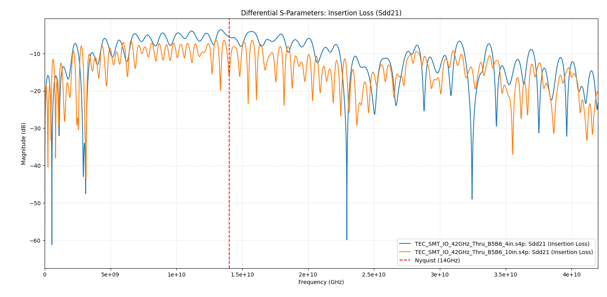
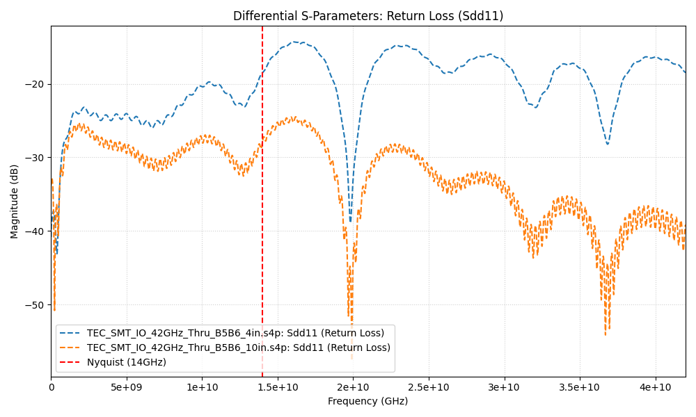

# 28g-smt-io-channel-analysis
Python script utilizing scikit-rf to plot and compare mixed-mode S-parameters for the 28 Gb/s SMT IO channel models (4-inch vs. 10-inch host) used in the IEEE P802.3bs (400GbE) Task Force analysis.

## Project Overview

Analyzing and verifying the electrical performance of high-speed interconnects used in the development of **IEEE P802.3bs (200 GbE and 400 GbE)** Ethernet standards.

The core analysis focuses on comparing the insertion loss and return loss of **28 Gb/s High Density SMT IO** channel models across different host PCB lengths.

## Methodology

The primary goal of this script is to assess the impact of host PCB trace length on signal integrity, specifically comparing the 4-inch host channel against the 10-inch host channel, which represents the longest supported electrical path.

TEC_SMT_IO_42GHz_Thru_B5B6_4in.s4p: Loss @14GHz = -5.60 dB

TEC_SMT_IO_42GHz_Thru_B5B6_10in.s4p: Loss @14GHz = -15.94 dB

TEC_SMT_IO_42GHz_Thru_B5B6_4in.s4p: Loss @14GHz = -11.44 dB

TEC_SMT_IO_42GHz_Thru_B5B6_10in.s4p: Loss @14GHz = -17.98 dB

The Nyquist frequency for this analysis is **14 GHz** (based on 28 Gbaud signaling)

## Contribution
If you find issues or have suggestions for additional plots (e.g., Time Domain Reflectometry/TDR), feel free to open an issue or submit a pull request.

## License
This project is licensed under the MIT License - see the LICENSE file for details.